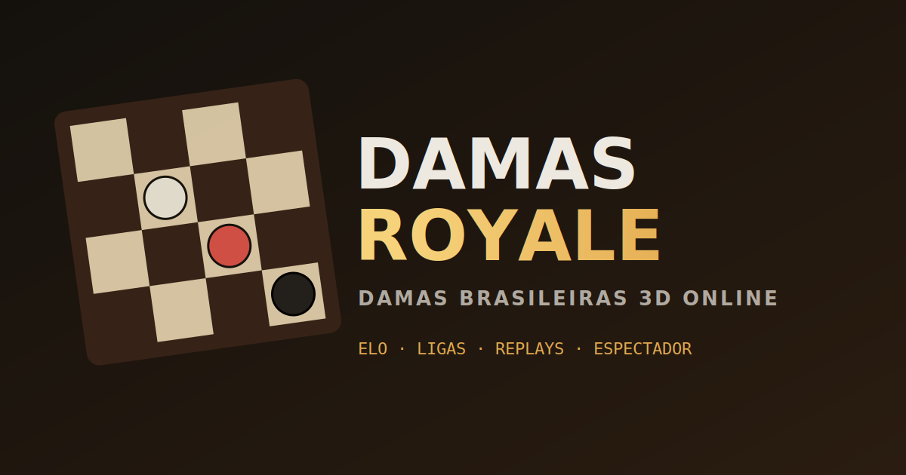

# 👑 DAMAS ROYALE — Damas Brasileiras 3D

<p align="center">
  
  
  
  
  
</p>

<p align="center">
  
</p>

Damas Royale é um jogo de damas 3D moderno com regras oficiais brasileiras. Desenvolvido em **Three.js** puro usando módulos ES nativos (sem necessidade de processos de build complexos) e integrado com o **Google Firebase** para partidas em tempo real, sistema de Elo, **ligas competitivas**, conquistas e ranking global.

A interface conta com uma estética premium em *glassmorphism* escuro e detalhes dourados reais, é um **PWA instalável**, funciona em **PT / EN / ES** e foi pensada para celular e desktop.

<p align="center">
  
</p>

---

## 🏆 Top 3 Grandes Mestres (Ao Vivo)

<!-- TOP_RANKING_START -->

| 🏆 Posição | Jogador | Elo |
| :---: | :--- | :---: |
| 🥇 1º | **KAUA3** | 1218 |

*Última atualização: 19/06/2026, 23:39 (Automático)*

<!-- TOP_RANKING_END -->

<!-- TOTAL_MATCHES_START -->
> 🔥 Já foram disputadas **74** partidas épicas no Damas Royale!
<!-- TOTAL_MATCHES_END -->

---

## 🎮 Modos de Jogo

| Modo | Descrição |
| :--- | :--- |
| **LOCAL** | 2 jogadores no mesmo dispositivo, com rotação automática da câmera 3D. |
| **MÁQUINA** | Jogue contra o computador (IA Minimax com poda Alfa-Beta + busca Quiescence) em 3 dificuldades. Inclui botões para desfazer lances e pedir dicas táticas. |
| **ONLINE** | Partida rápida com fila de pareamento inteligente por faixa de Elo ou criação de salas privadas (convite via código de 6 letras ou link de acesso direto). |
| **ESPECTADOR** | Assista a partidas de outros jogadores ativos na nuvem em tempo real sem interferir no jogo. |
| **REPLAY** | Analise e reproduza jogada a jogada (com timeline 3D deslizante) qualquer partida anterior do seu histórico. |

---

## 🏅 Sistema Competitivo & Social

| Recurso | Descrição |
| :--- | :--- |
| **Ligas com divisões** | 9 ligas — **Ferro → Bronze → Prata → Ouro → Platina → Esmeralda → Diamante → Mestre → Grão-Mestre** — com subdivisões **I–IV**, derivadas do Elo. Emblema colorido e barra de progresso até a próxima divisão. |
| **Perfil do jogador** | Avatar, liga, taxa de vitória, melhor sequência, gráfico de evolução do Elo e partidas recentes. |
| **Perfil público & Busca** | Clique no nome de qualquer jogador (ranking/lista) para ver o perfil dele, ou **pesquise jogadores por nome**. |
| **Amigos** | Envie e aceite pedidos de amizade (persistidos na nuvem), desafie amigos diretamente e veja quem está online. |
| **Conquistas** | Medalhas desbloqueáveis: primeira dama, vitória sem perder peça, sequências de vitórias, subir de liga e mais. |
| **Chat rápido & Emotes** | Frases pré-definidas e balões de emote 3D para comunicação amigável (com *cooldown* anti-spam). |
| **Revanche** | Ao fim de uma partida online, desafie o mesmo oponente com um clique. |
| **Replay compartilhável** | Gere um link `?replay=<id>` de qualquer partida do histórico para outras pessoas assistirem. |
| **Imagem de resultado** | Exporte um card (placar + Elo + liga) para compartilhar via Web Share ou download. |

---

## ⚡ Recursos Adicionais Premium

*   **Arenas Imersivas e Clima Dinâmico**: Jogue em ambientes 3D como Taverna Medieval, Jardim Zen, Cyberpunk ou Vulcão. A neblina e as partículas de clima (chuva, poeira, folhas de cerejeira, fagulhas) reagem ao tema escolhido em tempo real.
*   **Menu de Personalização (Loadout)**: Escolha sua Arena (renderizada localmente para máxima performance) e as Skins do seu exército (sincronizadas com o oponente) antes da batalha.
*   **Finalizações Cinematográficas**: O motor do jogo prevê o lance final da partida, aplicando **Câmera Lenta (Bullet-Time)** no último movimento, seguido de uma chuva de confetes/fogos de artifício 3D na cor do exército vencedor.
*   **Otimização Mobile**: Botões dedicados de Zoom in/out e centralização de câmera inteligente garantem a melhor experiência em telas pequenas.
*   **Sistema de Desafios Diretos**: Visualize jogadores online ativos na nuvem e envie um desafio imediato.
*   **Recuperação de Sessão (Session Recovery)**: Em caso de queda de conexão, a partida é retomada automaticamente de onde parou.
*   **Relógio de Jogo Sincronizado**: Controle de tempo online competitivo (Blitz) no formato Fischer (tempo base + acréscimo por lance).
*   **Reações e Emotes Rápidos**: Comunique-se usando balões flutuantes em 3D sobre o tabuleiro.
*   **Google Sign-In**: Login integrado para persistir estatísticas, taxa de vitória e histórico em múltiplos dispositivos.
*   **Som Sintetizado**: Feedback de áudio sintetizado em tempo real via Web Audio API.
*   **PWA Instalável**: Banner de instalação e funcionamento offline do app-shell via Service Worker.
*   **Multilíngue (i18n)**: Interface em Português, Inglês e Espanhol, selecionável no menu.
*   **Acessibilidade**: Tema de tabuleiro de **alto contraste** e peças **amarelo × azul** (seguro para daltonismo vermelho-verde), além de **modo silencioso** de 1 toque (som + música + vibração).
*   **Landing Page**: Página de apresentação na raiz (`/`), com o jogo servido em `/play`.

---

## 📜 Regras Oficiais Brasileiras Implementadas

*   **Tabuleiro 8x8**: 12 peças para cada lado. As claras começam.
*   **Captura Obrigatória & Lei da Maioria**: Se houver mais de uma opção de captura, o jogador deve obrigatoriamente escolher a linha que captura o maior número de peças adversárias.
*   **Pedra**: Captura tanto para frente quanto para trás.
*   **Dama Voadora**: Move-se e captura em diagonal a qualquer distância, podendo escolher onde parar após a última peça capturada.
*   **Promoção**: A pedra só se torna Dama se o movimento terminar na última linha adversária.
*   **Sem Salto Duplo**: Uma peça capturada não pode ser saltada duas vezes na mesma jogada (ela só é removida do tabuleiro após o término do movimento completo).
*   **Critérios de Empate**: Repetição de posição por 3 vezes ou 20 lances seguidos de Damas sem captura ou avanço de pedras.

---

## 🛠️ Como Rodar Localmente

Por utilizar módulos ES puros para o carregamento do Three.js e Firebase, o jogo não pode ser aberto diretamente pelo sistema de arquivos (`file://`). Ele precisa de um servidor estático local.

### Usando XAMPP (Windows):
1. Coloque a pasta do projeto dentro de `C:\xampp\htdocs\damas\`.
2. Inicie o servidor Apache no painel do XAMPP.
3. Acesse `http://localhost/damas/` no navegador.

### Usando extensões ou outros servidores rápidos:
*   Se usar o VS Code, utilize a extensão **Live Server** para rodar com um clique.
*   Ou use o Python no terminal da pasta:
    ```bash
    python -m http.server 8000
    ```
    Em seguida, acesse `http://localhost:8000`.

> **Rotas em produção (Vercel):** a raiz `/` serve a **landing page** ([landing.html](landing.html)) e o jogo fica em **`/play`** (veja [vercel.json](vercel.json)). Links de sala (`?room=`) e de replay (`?replay=`) continuam funcionando — a landing os redireciona para o jogo automaticamente. Localmente (XAMPP/Python) a raiz abre o próprio jogo.

---

## ☁️ Ativando o Modo Online (Configuração do Firebase)

Para habilitar as partidas online e o ranking global:

1. Crie um projeto gratuito em [Firebase Console](https://console.firebase.google.com).
2. Adicione um **App Web** (ícone `</>`), copie o objeto de configuração `firebaseConfig`.
3. Cole as chaves em [js/firebase-config.js](js/firebase-config.js).
4. No menu lateral do Firebase:
   *   Vá em **Authentication -> Sign-in Method** e ative o provedor **Anônimo** e o **Google**.
   *   Crie o banco **Firestore Database**. As regras de segurança ficam versionadas no
       arquivo [firestore.rules](firestore.rules) deste repositório.

Para publicá-las, instale a [Firebase CLI](https://firebase.google.com/docs/cli) e rode:

```bash
firebase deploy --only firestore:rules
```

   *   Alternativamente, copie o conteúdo de [firestore.rules](firestore.rules) e cole na
       aba **Rules** do Firestore Console.

> **Flag de desenvolvedor:** o acesso a dica/análise no modo online é controlado pelo campo
> `dev: true` no documento `players/{uid}` — gravável **apenas** via Console/Admin SDK (as
> regras impedem o cliente de defini-lo). Não é mais liberado digitando um apelido.

> **Segurança:** as regras travam a adulteração de partidas/histórico por terceiros e limitam o salto de Elo, mas o cálculo do rating ainda acontece no cliente (arquitetura serverless). Para reforçar contra abuso de cota e bots, ative o **App Check** (reCAPTCHA) e restrinja os **domínios autorizados** em *Authentication → Settings → Authorized domains* (deixe só o domínio do Vercel e `localhost`). Em produção real, o cálculo de Elo e a gravação do histórico deveriam migrar para uma **Cloud Function** com verificação de servidor.

---

## 🧪 Testes

A lógica pura (regras, Elo e IA) tem testes sem dependências:

```bash
node tests/suite.mjs        # no terminal
```

Ou abra `tests/index.html` no navegador (via servidor estático) para o relatório visual. Cobre captura obrigatória + lei da maioria, captura para trás, dama voadora, promoção, serialização de lances, cálculo de Elo e sanidade da IA.

## 📂 Estrutura do Código

| Arquivo | Descrição |
| :--- | :--- |
| `js/rules.js` | Motor lógico puro do jogo de damas (geração e validação de lances, notação, serialização). |
| `js/ai.js` | Inteligência Artificial baseada em algoritmo Minimax (poda alfa-beta, quiescence e dicas). |
| `js/elo.js` | Lógica de cálculo de rating Elo (K dinâmico) e título derivado da liga. |
| `js/leagues.js` | Sistema de ligas competitivas (9 ligas × divisões I–IV) a partir do Elo. |
| `js/achievements.js` | Catálogo de conquistas e avaliação dos predicados ao fim da partida. |
| `js/i18n.js` | Internacionalização (PT/EN/ES) dos rótulos da interface. |
| `js/online.js` | Integração Firebase: matchmaking, salas, desafios, amigos, conquistas, perfil público, busca, reconexão e histórico. |
| `js/main.js` | Orquestrador principal (máquina de estados, loop de turnos, inputs 3D e integrações). |
| `js/scene.js` | Configuração da cena, renderização, iluminação e materiais em Three.js. |
| `js/board3d.js` | Renderização e montagem do modelo 3D do tabuleiro. |
| `js/pieces3d.js` | Criação geométrica das peças, coroas de Damas e suas animações físicas de movimento. |
| `js/fx.js` | Gerenciamento de partículas, grids de movimento, tremor de câmera e marcadores 3D. |
| `js/input.js` | Controles de órbita da câmera 3D, picking de cliques e comportamento de drag & drop. |
| `js/ui.js` | Manipulação e atualização do DOM (placar, menus flutuantes, histórico na tela, modais). |
| `js/audio.js` | Síntese e reprodução de efeitos sonoros usando a Web Audio API (sem arquivos de áudio pesados). |
| `js/history.js` | Registro das jogadas em notação algébrica esportiva tradicional. |
| `js/themes.js` | Definição de paletas de cores, materiais e temas para o tabuleiro e peças. |
| `js/utils.js` | Funções utilitárias auxiliares de suporte. |
